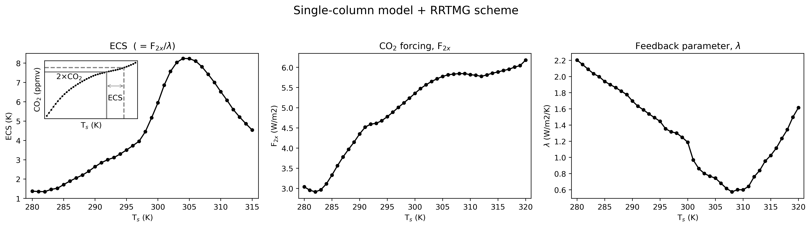
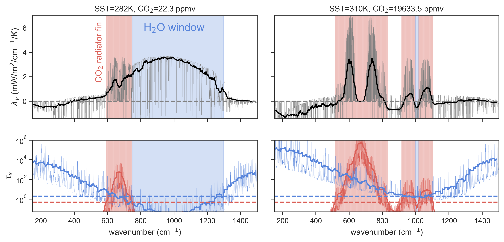

# 
 ECS_Bump 

Repo to reproduce the results of Meraner et al. (2013) and Seeley and Jeevanjee (2020) with RRTMG and PyRADS

Created/Mantained By: Andrew Williams (andrew.williams@physics.ox.ac.uk)

  

  

> Abstract: 

### To-do

 - [x] Go through a couple of the `climlab` tutorials and get a simple SCM model going. 
 - [x] Iterate through various surface temperatures and calculate the ECS for each one.
 - [x] Calculate decomposition into $F_2x$ and $lambda_eff$ terms.
 
 - [x] Qu: Can climlab's RRTMG interface give the spectrally resolved OLR? Like, averaged in its 16 LW bands? That would be cool
  - Edit: Not really, it'd be a bit of work I think - not worth it for now.
  - EDIT: See [this `climlab` issue I raised](https://github.com/brian-rose/climlab/issues/137), hopefully it should result in a PR which allows access to the underlying RRTMG_LW fluxes through `climlab`! :) 
 
 - [x] Use PyRADS for a simple spectral decomposition of the OLR changes. Do we see the `H20 windows` and `C02 radiator fins`??

### Installation

An `environment.txt` file is provided from which you can generate an `rce_bump` environment with the command `conda create --name rce_bump --file environment.txt`. 

To add this environment to you `jupyter lab` instance, you must first activate this environment and then run `ipython kernel install --user --name=rce_bump`.

### Acknowledgements:

Thanks to Brian Rose for creating  [climlab](https://climlab.readthedocs.io/), which allows for a convenient Python interface to RRTMG, and also a suite of exciting options for open-source climate modelling!

Also thanks to Daniel Koll for creating and maintaining [PyRADS](https://github.com/ddbkoll/PyRADS/), which is the line-by-line code I use here and which also has an intuitive Python API. :)

### References:

1) Seeley, J. T., & Jeevanjee, N. (2020). H2O windows and CO2 radiator fins: a clear‐sky explanation for the peak in ECS. Geophysical Research Letters, 47, e2020GL089609. https://doi.org/10.1029/2020GL089609

2) Meraner, K., Mauritsen, T., and Voigt, A. (2013), Robust increase in equilibrium climate sensitivity under global warming, Geophys. Res. Lett., 40, 5944– 5948, doi:10.1002/2013GL058118.
